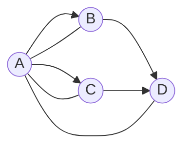

# Formatos para grafos

## Listas de adyacencia
Las listas de adyacencia son el formato más común para almacenar un grafo. Su estructura es parecida a un diccionario, donde cada nodo se empareja con la lista de nodos que son adyacentes a él. Por ejemplo en JSON:

```json
{
    "a": ["b", "c"],
    "b": ["a", "d"],
    "c": ["a", "d"]
}
```

Esto nos daría un grafo como este:



Un grafo dirigido puede tener los nodos en una dirección pero no en la otra. Pero los no dirigidos son mutuos: el nodo A apunta al B y viceversa. ¿Pero y los nodos no dirigidos cómo se escriben?

## El formato Graphim
Para los grafos en Graphim, usaremos una estructura de datos en texto propios: un **sistema de adyacencia** propio basado en la sintaxis de Mermaid:

> [!Warning]
>
> Proximamente más opciones, como pesos y colores

```
# Comentarios en línea
# Cada instrucción debe ir en una línea

A # Nodo
[A, B] # Lista de nodos
A -> B # Nodo dirigido
A -- B # Nodo no dirigido
A -> [B, C, D] # Listas de adyacencia
```

Los detalles del parser se explicarán cuando esté implementado.
