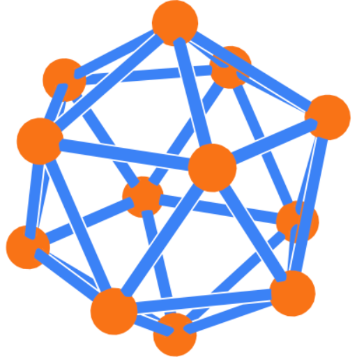
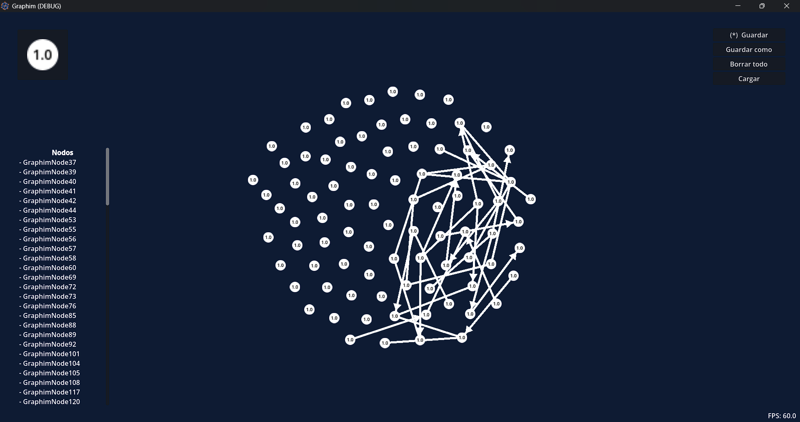

    
    <h1>Graphim</h1>

Graphim es un editor visual de grafos y algoritmos hecho en Godot. Desarrollado como proyecto final de matemáticas discretas para 2026-1.

## Integrantes del proyecto

1. Hayran Andrés López
1. Helberth Rodriguez

## License
MIT para todos los recursos a menos de que se indique algo diferente.

Efectos de sonido por 

- Sonido de pop de [freesound_community](https://pixabay.com/es/users/freesound_community-46691455/?utm_source=link-attribution&utm_medium=referral&utm_campaign=music&utm_content=43196) en Pixabay
- Sonido de lápiz por [u_viypcpsnud](https://pixabay.com/es/users/u_viypcpsnud-51768955/?utm_source=link-attribution&utm_medium=referral&utm_campaign=music&utm_content=389258) en Pixabay
- Sonido de eliminar por [u_r9am5j3c5j](https://pixabay.com/es/users/u_r9am5j3c5j-32593918/?utm_source=link-attribution&utm_medium=referral&utm_campaign=music&utm_content=132084) en Pixabay
- Sonido de mezclar por [Alex](https://pixabay.com/es/users/oxidvideos-37598254/?utm_source=link-attribution&utm_medium=referral&utm_campaign=music&utm_content=522518) en Pixabay
